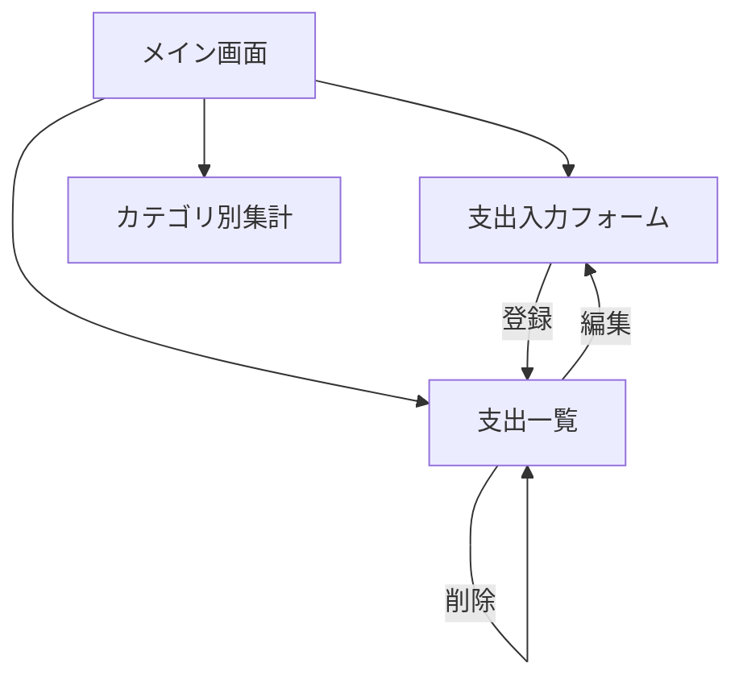
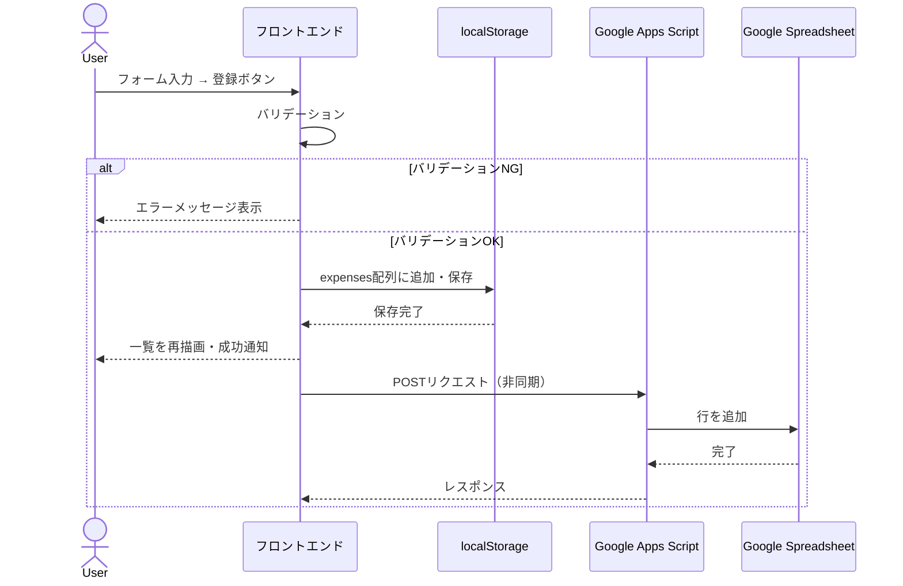
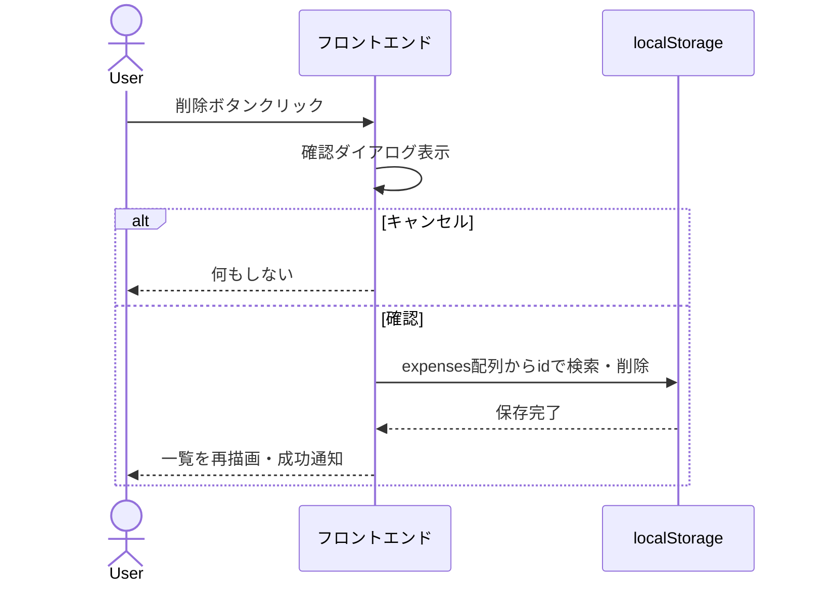

# 支出管理アプリ 仕様書

## 1. 概要

日々の支出を記録・管理するためのWebアプリケーション。ブラウザ上で動作し、localStorageによるローカル保存とGoogle Spreadsheetへのクラウド同期を備える。

---

## 2. 技術スタック

| レイヤー | 技術 | 用途 |
|---|---|---|
| **フロントエンド** | HTML / CSS / JavaScript | UI・ロジック |
| **ローカル保存** | localStorage | オフライン対応・即時保存 |
| **クラウド保存** | Google Spreadsheet | データバックアップ・共有 |
| **バックエンド** | Google Apps Script (GAS) | Spreadsheet API中継 |
| **ホスティング** | GitHub Pages | 静的サイト公開 |
| **バージョン管理** | Git / GitHub | ソースコード管理 |

---

## 3. 機能一覧

### 3.1 支出記録（CRUD）

| 機能 | 説明 | 優先度 |
|---|---|---|
| **新規登録** | 日付・カテゴリ・金額・メモを入力して支出を記録 | 🔴 必須 |
| **一覧表示** | 記録済みの支出をリスト形式で表示 | 🔴 必須 |
| **削除** | 個別の支出レコードを削除 | 🔴 必須 |
| **編集** | 既存の支出レコードを修正 | 🟡 推奨 |

#### 入力フィールド仕様

| フィールド | 型 | 必須 | バリデーション | デフォルト値 |
|---|---|---|---|---|
| 日付 | `date` | ✅ | 未来日付は許可、空欄不可 | 当日の日付 |
| カテゴリ | `select` | ✅ | プリセットから選択 | 「食費」 |
| 金額 | `number` | ✅ | 1以上の整数、空欄不可 | なし |
| メモ | `text` | ❌ | 最大100文字 | 空欄 |

### 3.2 カテゴリ別集計

| 機能 | 説明 | 優先度 |
|---|---|---|
| **カテゴリ別合計** | カテゴリごとの支出合計金額を表示 | 🔴 必須 |
| **月別フィルタ** | 表示対象の月を切り替え | 🟡 推奨 |
| **グラフ表示** | 円グラフまたは棒グラフで視覚化 | 🟢 任意 |

### 3.3 データ永続化

| 機能 | 説明 | 優先度 |
|---|---|---|
| **localStorage保存** | 操作のたびに自動保存 | 🔴 必須 |
| **GAS連携** | Google Spreadsheetへの同期 | 🟡 推奨 |
| **エクスポート** | CSV形式でダウンロード | 🟢 任意 |

---

## 4. データ構造

### 4.1 支出レコード（Expense）

```javascript
{
  id: Number,          // ユニークID（Date.now() で生成）
  date: String,        // 日付 "YYYY-MM-DD"
  category: String,    // カテゴリ名
  amount: Number,      // 金額（整数、円単位）
  memo: String,        // メモ（任意）
  createdAt: String,   // 作成日時 ISO 8601
  updatedAt: String    // 更新日時 ISO 8601
}
```

### 4.2 localStorageキー設計

| キー | 型 | 説明 |
|---|---|---|
| `expenses` | `Array<Expense>` | 支出レコードの配列 |
| `categories` | `Array<string>` | カスタムカテゴリ一覧（将来拡張用） |
| `settings` | `Object` | アプリ設定（将来拡張用） |

### 4.3 プリセットカテゴリ

| カテゴリ | アイコン例 |
|---|---|
| 🍽️ 食費 | 食事・食料品 |
| 🚃 交通費 | 電車・バス・タクシー |
| 🎮 娯楽費 | 映画・ゲーム・趣味 |
| 🏠 住居費 | 家賃・光熱費 |
| 👕 衣服費 | 洋服・靴・アクセサリー |
| 💊 医療費 | 病院・薬 |
| 📚 教育費 | 書籍・セミナー |
| 📦 日用品 | 消耗品・雑貨 |
| 🎁 交際費 | プレゼント・飲み会 |
| ❓ その他 | 上記に該当しないもの |

### 4.4 localStorageデータ例

```json
{
  "expenses": [
    {
      "id": 1696501234567,
      "date": "2025-10-05",
      "category": "食費",
      "amount": 800,
      "memo": "ランチ",
      "createdAt": "2025-10-05T12:00:34.567Z",
      "updatedAt": "2025-10-05T12:00:34.567Z"
    },
    {
      "id": 1696501299000,
      "date": "2025-10-05",
      "category": "交通費",
      "amount": 330,
      "memo": "電車代",
      "createdAt": "2025-10-05T18:30:00.000Z",
      "updatedAt": "2025-10-05T18:30:00.000Z"
    }
  ]
}
```

---

## 5. 画面構成

### 5.1 画面一覧



> [!NOTE]
> SPA（Single Page Application）構成を想定。すべての機能を1ページ内にセクション分けして配置する。

### 5.2 レイアウト構成

```
┌─────────────────────────────────────┐
│           ヘッダー / タイトル          │
├─────────────────────────────────────┤
│         月別ナビゲーション             │
│       ◀ 2025年10月 ▶               │
├─────────────────────────────────────┤
│         サマリーカード                │
│  ┌──────┐ ┌──────┐ ┌──────┐        │
│  │今月合計│ │件数  │ │日平均 │       │
│  │¥45,200│ │ 23件 │ │¥1,964│       │
│  └──────┘ └──────┘ └──────┘        │
├─────────────────────────────────────┤
│         支出入力フォーム              │
│  日付 [____] カテゴリ [▼____]       │
│  金額 [____] メモ    [________]     │
│              [登録ボタン]            │
├─────────────────────────────────────┤
│         カテゴリ別集計               │
│  🍽️ 食費      ¥12,500  ████████   │
│  🚃 交通費    ¥8,200   █████      │
│  🎮 娯楽費    ¥5,000   ███        │
│  ...                               │
├─────────────────────────────────────┤
│         支出一覧                    │
│  10/05 🍽️ ランチ    ¥800   [🗑️]   │
│  10/05 🚃 電車代    ¥330   [🗑️]   │
│  10/04 🎮 映画      ¥1,800 [🗑️]   │
│  ...                               │
└─────────────────────────────────────┘
```

---

## 6. 処理フロー

### 6.1 支出登録フロー



### 6.2 支出削除フロー



---

## 7. Google Apps Script (GAS) 連携仕様

### 7.1 エンドポイント

GASをWebアプリとしてデプロイし、REST API的に利用する。

| メソッド | 用途 | パラメータ |
|---|---|---|
| `POST` (doPost) | 支出レコードの追加 | `{date, category, amount, memo}` |
| `GET` (doGet) | 全レコード取得 | `?action=getAll` |

### 7.2 Spreadsheetシート構成

| 列 | 内容 | 型 |
|---|---|---|
| A | ID | Number |
| B | 日付 | Date |
| C | カテゴリ | String |
| D | 金額 | Number |
| E | メモ | String |
| F | 作成日時 | Datetime |

### 7.3 GASコード概要

```javascript
// doPost: 支出レコードを受け取りSpreadsheetに追記
function doPost(e) {
  const sheet = SpreadsheetApp.getActiveSpreadsheet().getSheetByName("expenses");
  const data = JSON.parse(e.postData.contents);
  sheet.appendRow([data.id, data.date, data.category, data.amount, data.memo, new Date()]);
  return ContentService.createTextOutput(JSON.stringify({ status: "ok" }))
    .setMimeType(ContentService.MimeType.JSON);
}

// doGet: 全レコードをJSON形式で返却
function doGet(e) {
  const sheet = SpreadsheetApp.getActiveSpreadsheet().getSheetByName("expenses");
  const rows = sheet.getDataRange().getValues();
  // ヘッダー行をスキップしてJSON変換
  const data = rows.slice(1).map(row => ({
    id: row[0], date: row[1], category: row[2],
    amount: row[3], memo: row[4], createdAt: row[5]
  }));
  return ContentService.createTextOutput(JSON.stringify(data))
    .setMimeType(ContentService.MimeType.JSON);
}
```

> [!IMPORTANT]
> GASのデプロイ時は「ウェブアプリ」として公開し、アクセス権限を「全員」に設定する必要がある。CORS制限を回避するため、フロントエンドからは `fetch` の `mode: 'no-cors'` または GAS側でレスポンスヘッダーを設定する。

---

## 8. ファイル構成

```
expense-tracker/
├── index.html          # メインHTML
├── css/
│   └── style.css       # スタイルシート
├── js/
│   ├── app.js          # アプリ初期化・イベント管理
│   ├── storage.js      # localStorage操作モジュール
│   ├── ui.js           # DOM操作・レンダリング
│   ├── categories.js   # カテゴリ定義・集計ロジック
│   └── gas-sync.js     # GAS連携（非同期通信）
├── .gitignore
└── README.md
```

### モジュール責務

| ファイル | 責務 |
|---|---|
| `app.js` | アプリの初期化、イベントリスナー登録、各モジュールの統合 |
| `storage.js` | localStorage への CRUD 操作を抽象化 |
| `ui.js` | DOM の生成・更新・削除、テンプレート描画 |
| `categories.js` | カテゴリ定義、カテゴリ別集計ロジック |
| `gas-sync.js` | GAS エンドポイントへの非同期通信 |

---

## 9. バリデーション仕様

| フィールド | ルール | エラーメッセージ |
|---|---|---|
| 日付 | 空でないこと、有効な日付形式 | 「日付を入力してください」 |
| カテゴリ | プリセット内の値 | 「カテゴリを選択してください」 |
| 金額 | 1以上の整数 | 「正しい金額を入力してください（1円以上）」 |
| メモ | 100文字以内 | 「メモは100文字以内で入力してください」 |

---

## 10. 非機能要件

| 項目 | 要件 |
|---|---|
| **レスポンシブ対応** | スマートフォン（375px〜）からデスクトップまで対応 |
| **オフライン動作** | localStorageベースのため、ネットワーク不要で基本機能が動作 |
| **パフォーマンス** | 初回ロード3秒以内（GitHub Pages配信前提） |
| **ブラウザ対応** | Chrome / Safari / Firefox 最新版 |
| **アクセシビリティ** | セマンティックHTML、適切なlabel要素の紐付け |
| **データ容量** | localStorage上限（約5MB）を考慮。約20,000件の支出レコードを想定 |

---

## 11. 将来の拡張候補

| 機能 | 説明 |
|---|---|
| 予算設定 | 月ごとの予算上限を設定し、超過時にアラート |
| 定期支出の自動登録 | 家賃などの固定費を自動記録 |
| データインポート | CSV取り込み機能 |
| PWA対応 | Service Workerによる完全オフライン対応・ホーム画面追加 |
| ダークモード | テーマ切り替え |
| 複数ユーザー対応 | ログイン機能・Firebaseなどクラウド連携 |

---

## 12. 開発スケジュール（参考）

| フェーズ | 内容 | 目安期間 |
|---|---|---|
| **Phase 1** | HTML/CSS 基盤、localStorage CRUD | 1〜2日 |
| **Phase 2** | カテゴリ別集計、月別フィルタ | 1日 |
| **Phase 3** | GAS連携（Spreadsheet同期） | 1〜2日 |
| **Phase 4** | UI改善、レスポンシブ対応、デプロイ | 1日 |

スプレットシートURL
https://docs.google.com/spreadsheets/d/1Qj2aRj9LWIRd8tDQAAkSOxtA1GK9aezqu3h_Mvm37t4/edit?gid=0#gid=0

ウェブアプリURL
https://script.google.com/macros/s/AKfycbxFwb-_BN4rlhSt9EnjfmbzPnlzCGgEYWFS38lY_0d74n9jZGE-mYE2wy5DruS-MVOe/exec

デプロイ ID
AKfycbxFwb-_BN4rlhSt9EnjfmbzPnlzCGgEYWFS38lY_0d74n9jZGE-mYE2wy5DruS-MVOe
